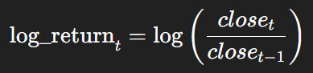
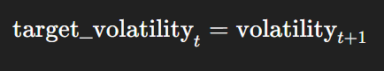

# Low-Level Design (LLD) Document

## Bitcoin Volatility Prediction Using Machine Learning

### 1. Introduction

This Low-Level Design (LLD) document provides a detailed technical breakdown of the internal implementation of the Bitcoin volatility prediction system. It explains how each module processes data, the algorithms used, and how the machine learning model is trained and evaluated.

### 2. Dataset Description and Structure
2.1 Dataset Source

- The dataset is loaded from a compressed CSV file.

- It contains historical cryptocurrency market data for multiple cryptocurrencies.

#### 2.2 Important Columns Used

- date: Trading date

- open, high, low, close: OHLC price values

- volume: Trading volume

- marketCap: Market capitalization

- crypto_name: Cryptocurrency identifier

### 3. Data Ingestion Module (Implementation)
#### 3.1 File Handling

- The dataset is extracted from a ZIP file using Python’s zipfile module.

- Relative paths are used to ensure portability.

#### 3.2 Data Loading

- The CSV file is loaded into a Pandas DataFrame using pd.read_csv().

#### 3.3 Initial Inspection

- df.head(), df.shape, and df.info() are used to inspect structure and data types.

### 4. Cryptocurrency Filtering Module
#### 4.1 Filtering Logic

- The dataset is filtered where crypto_name == 'Bitcoin'.

- A copy of the filtered DataFrame is created to avoid chained assignment issues.

#### 4.2 Justification

- Bitcoin is selected to reduce complexity and focus on a single, stable time-series.

### 5. Data Cleaning and Preparation Module
#### 5.1 Column Removal

- An index-like column (Unnamed: 0) is removed as it does not contribute to prediction.

#### 5.2 Date Processing

- The date column is converted to datetime format using pd.to_datetime().

#### 5.3 Time-Series Ordering

- Data is sorted chronologically using sort_values('date').

- Index is reset after sorting.

#### 5.4 Missing Value Handling

- Null value checks confirm no missing values.

- Zero-volume rows are removed to avoid invalid volatility calculations.

### 6. Volatility Computation Module (Core Logic)
#### 6.1 Log Return Calculation

Daily log returns are computed using:

- Log returns are preferred due to statistical stability.

#### 6.2 Rolling Volatility Calculation

- Volatility is computed as a 7-day rolling standard deviation of log returns.

volatility
𝑡
=

#### 6.3 Target Variable Creation

- The target variable is defined as next-day volatility using a forward shift.

	​
### 7. Feature Engineering Module
7.1 Price-Based Features

- abs_return: Absolute value of log return

- high_low: Difference between daily high and low price

#### 7.2 Liquidity Feature

liquidity_ratio is computed as:

liquidity_ratio
=
volume
marketCap
liquidity_ratio=
marketCap
volume
	​

#### 7.3 Lagged Volatility Features

Lag features are created to capture temporal dependency:

- volatility_lag_1

- volatility_lag_3

- volatility_lag_7

- volatility_lag_14

#### 7.4 Final Cleaning

- Rows containing NaN values due to rolling or shifting operations are removed.

### 8. Exploratory Data Analysis (EDA) Module
#### 8.1 Price Trend Visualization

- Line plots are used to visualize long-term Bitcoin price movement.

#### 8.2 Volatility Trend Visualization

- Volatility values are plotted over time to observe clustering behavior.

#### 8.3 Correlation Analysis

- A correlation heatmap is generated for numerical features.

- Strong correlation is observed between lagged volatility features and target volatility.

### 9. Data Preparation for Modeling
#### 9.1 Feature Selection

Final features selected:

- Lagged volatility features

- Absolute return

- Liquidity ratio

- High-Low price range

#### 9.2 Train-Test Split

- An 80:20 time-based split is applied.

- Earlier data is used for training, later data for testing.

- This prevents future data leakage.

### 10. Machine Learning Model Design
#### 10.1 Model Selection

- Random Forest Regressor is used.

#### 10.2 Justification

- Handles non-linear relationships effectively

- Robust to noise

- Requires minimal feature scaling

#### 10.3 Model Configuration (Model-1)

- Number of trees: 400

- Maximum depth: 6

- Minimum samples per leaf: 20

- Minimum samples to split: 40

#### 10.4 Model Training

- The model is trained using fit() on training data.

- Predictions are generated on test data.

### 11. Model Evaluation Module
#### 11.1 Evaluation Metrics

- Root Mean Squared Error (RMSE)

- Mean Absolute Error (MAE)

- R² Score

#### 11.2 Overfitting Check

- Train RMSE and Test RMSE are compared.

- Test RMSE being slightly lower indicates good generalization.

#### 11.3 Baseline Comparison

- A naïve baseline using previous-day volatility is evaluated.

- The machine learning model outperforms the baseline.

### 12. Model Optimization Module
#### 12.1 Tuned Model

- A second Random Forest model is trained with increased depth and estimators.

- Performance is compared against the base model.

#### 12.2 Observation

- Tuned model shows marginal improvement, validating model stability.

### 13. Visualization Module
#### 13.1 Feature Importance

- Feature importance scores are extracted from the trained model.

- Lag-1 volatility is the most influential feature.

#### 13.2 Prediction Visualization

- Actual vs predicted volatility curves are plotted.

- Predictions closely follow actual volatility patterns.

### 14. Conclusion

The Low-Level Design demonstrates a well-structured and technically sound implementation of a volatility prediction system. Each module is aligned with financial time-series best practices, ensuring reliability, interpretability, and robustness.